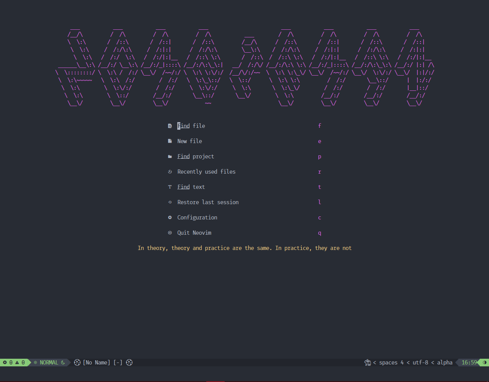

# nvim-config
My config for Neovim, based on [LunarVim/Neovim-from-scratch](https://github.com/LunarVim/Neovim-from-scratch) from [chris@machine](https://www.youtube.com/channel/UCS97tchJDq17Qms3cux8wcA)'s YouTube tutorial series

